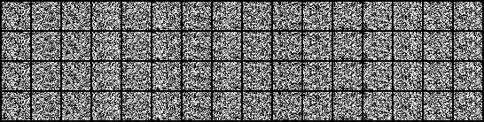
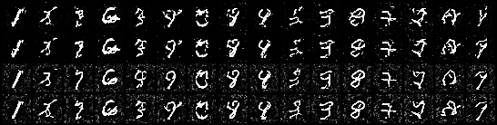
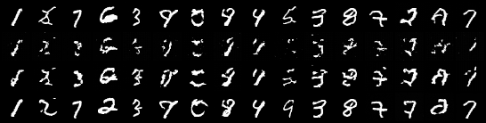

# napkin-dit

**UNet vs DiT × ε-prediction vs flow matching — a 2×2 at matched parameters and matched NFE.**

SD 1.5 / 2.1 are UNet + ε-prediction. Flux and Ideogram are DiT + flow matching. The field
changed both variables at roughly the same moment, so every public comparison confounds them:

> At 2.81M parameters and equal network evaluations, **which of the two changes is actually
> doing the work — and does either transfer down to napkin scale?**

Four cells, five seeds each, one shared implementation. Everything inherits
[napkin-diffusion](https://github.com/arose26/napkin-diffusion) (t07): the cosine schedule,
the σ-space solvers, Karras spacing, the NFE accounting, and FMD against the pinned full
MNIST test set.

## Result



*The same seed denoising in all four cells. Rows top→bottom: `unet/eps`, `unet/flow`,
`dit/eps`, `dit/flow`.*

FMD (lower is better), **IQM over 5 seeds with 95% bootstrap CIs**, Heun solver + Karras
spacing, n=10,000 samples against the full MNIST test set. NFE is the **actual spend**, not
the request. Cells whose CI overlaps the best cell in that row are marked `≈` — a tie is a
result, not a loss.

| NFE | dit/eps | dit/flow | unet/eps | unet/flow |
|---:|---:|---:|---:|---:|
| 3 | 13401 <sub>[12557, 13692]</sub> | 12413 `≈` <sub>[11949, 12943]</sub> | 13297 <sub>[13049, 13881]</sub> | **11344** <sub>[10589, 12249]</sub> |
| 7 | **47.7** <sub>[33.3, 98.2]</sub> | 57.0 `≈` <sub>[45.4, 78.4]</sub> | 219.4 <sub>[166.3, 273.4]</sub> | 280.1 <sub>[197.9, 357.5]</sub> |
| 15 | 6.86 `≈` <sub>[3.16, 76.3]</sub> | 3.82 `≈` <sub>[3.51, 4.51]</sub> | 7.71 <sub>[6.75, 9.62]</sub> | **3.64** <sub>[2.85, 4.41]</sub> |
| 31 | 5.62 <sub>[1.67, 95.7]</sub> | 2.16 <sub>[1.91, 3.34]</sub> | 4.89 <sub>[4.10, 5.81]</sub> | **1.20** <sub>[0.85, 1.58]</sub> |
| 63 | 5.74 <sub>[1.65, 91.1]</sub> | 2.11 <sub>[1.78, 3.84]</sub> | 4.25 <sub>[3.73, 5.09]</sub> | **0.97** <sub>[0.68, 1.25]</sub> |

### 1. The DiT buys low-NFE quality — and this one is solid

At 7 NFE the DiT is **4.6×** better than the UNet under ε-prediction and **4.9×** under flow
matching, with **no CI overlap in either column** (`dit/eps` [33.3, 98.2] vs `unet/eps`
[166.3, 273.4]; `dit/flow` [45.4, 78.4] vs `unet/flow` [197.9, 357.5]).

The rendered samples name the mechanism in one glance — **the UNet leaves background speckle at
7 NFE and the DiT does not** (pixels pinned at ±1: DiT 82%, UNet 58%):



*Rows: `dit/eps`, `dit/flow`, `unet/eps`, `unet/flow`, all at 7 NFE, same seed.*

Both arms run the **same sampler code** through the same `eps_hat(x̃, σ)` adapter, so this
cannot be a sampler difference. That is not an argument, it is the file structure — and it is
the single reason this result is interpretable.

### 2. At low NFE the *objective* is a tie

`unet` ε [166, 273] vs flow [198, 358]; `dit` ε [33, 98] vs flow [45, 78]. Overlapping in both
backbones. An earlier draft of this README read the point estimates and announced that
ε-prediction won here. It does not — the comparison is not resolvable at this budget.

Worth stating plainly: at 7 NFE the Heun sampler gets only **4 steps** and every cell scores
between 48 and 280 FMD, against 0.97 for the best high-NFE cell. This is a tie between
configurations that are all far from usable, not a demonstration that the objective stops
mattering.

### 3. Flow matching's high-NFE win is mostly a *spacing* artifact

This is the result that most changed on inspection, and the reason spacing was swept across all
four cells instead of riding along with the objective.

Read off the headline table, flow matching beats ε-prediction **4.4×** at 63 NFE in the UNet
(0.97 vs 4.25). But the headline fixes Karras spacing for everyone, and **Karras is a bad choice
for ε-prediction at high NFE**. Giving each objective its own best spacing — Heun, seeds
{0,1,2}, matched across spacings so the IQM trims identically:

| NFE 63, UNet | karras | t | u | own best |
|---|---:|---:|---:|---|
| `unet/eps` | 4.17 | **1.29** | 1.94 | `t` |
| `unet/flow` | **0.88** | 1.21 | 0.91 | `karras` |

- common Karras → flow wins **4.7×** (0.88 vs 4.17)
- each at its own best → **tie** (0.88 vs 1.29, CIs overlap)

Same story at 31 NFE: 4.3× at common spacing, a tie at own-best. The advantage survives at
15 NFE (3.41 vs 5.90) and is gone by 31.

**So "flow matching wins at high NFE" is largely a statement about the sampler you fixed, not
about the training objective.** Both readings are legitimate — common spacing is the strict
one-variable ablation, own-best is how a practitioner would actually deploy each method — but
publishing only the first, as the first draft of this README did, overstates the objective
effect by roughly 4×.

### 4. The pairing the field shipped is not the best cell here

DiT + flow matching scores **2.11** [1.78, 3.84] at 63 NFE. Keep flow matching and swap the
backbone *back* to a UNet: **0.97** [0.68, 1.25], non-overlapping. At napkin scale the two
modern choices do not compose — each helps at a different end of the NFE axis, and putting them
together buys neither advantage.

### The anomaly: `dit/eps` is seed-unstable **at the learning rate this probe selected**

Per-seed FMD at 63 NFE — `1.69, 1.72, 129.80, 1.64, 13.82`. Two of five seeds are degraded, and
the three healthy ones (~1.65) **beat `unet/eps` (3.71–5.12)**. So the UNet's apparent win in
the ε column at high NFE is a *reliability* gap, not a capability gap. It is also why every
`dit/eps` CI in the table above is enormous, and why the DiT rows of the spacing analysis are
not trustworthy — with 3 seeds the IQM trims nothing, so one collapsed seed dominates.

The failure is a **saturation collapse**: correct digit shapes with compressed dynamic range —
5.8% of pixels pinned at ±1 against 41% for a healthy seed. The collapsed seed had the **lowest
training loss in its cell** (0.0284 against a cell mean of 0.0310), which is as clean a
demonstration as this repo produced that ε-loss is not sample quality.



*Rows: `dit/eps` s0 (healthy), s2 (collapsed), s4 (mild), `unet/flow` s0 (reference).*

**Scope this claim carefully — the obvious control was not run.** Every cell trains at 2e-3,
chosen by the LR probe at ¼ length. That is 10× t07's 2e-4, and a ¼-length criterion structurally
favours fast-early over stable-late. So the measured statement is "DiT + ε-prediction is
seed-unstable **at 2e-3**"; the stronger reading — that it is inherently unstable at this scale —
is **untested here**. The control is one hour of compute (retrain seeds 2 and 4 at 5e-4 and see
whether the collapse disappears); it was cut for budget, not run and buried. Anyone rerunning
this should do it first.

## The thing that makes this comparison clean

Write both objectives in the σ parameterisation, where `x̃ = x₀ + σ·ε`:

```
DDPM:  x_t = √ᾱ·x̃,                σ = √((1−ᾱ)/ᾱ)
flow:  x_u = (1−u)x₀ + u·ε   →    x_u/(1−u) = x₀ + (u/(1−u))·ε
```

Same `x̃`, with `σ = u/(1−u)`. Both objectives induce **the identical probability-flow ODE**,
`dx̃/dσ = ε`. Asserted numerically at five noise levels: agreement to **3.0e-07** relative.

So flow matching and ε-prediction are not different generative processes. At a matched
sampler they differ only in **which noise levels training visits, how the loss weights them,
and whether the net emits ε or `v = ε − x₀`**. That has two consequences that shape the whole
repo:

1. **There is exactly one sampler in this file**, reached through a common `eps_hat(x̃, σ)`
   adapter. Two samplers would have confounded the objective axis with the implementer of
   its sampler.
2. **The canonical "flow matching sampler" is a step placement, not an objective.** Euler
   uniform-in-`u` is a specific σ spacing, and t07 already measured placement alone to be
   worth up to 2× at matched NFE. So spacing is swept across all four cells rather than
   riding along with the objective.

## The 2×2

|  | ε-prediction (DDPM, cosine VP) | flow matching (linear interpolant, v-target) |
|---|---|---|
| **UNet** 32/64/128ch, attn at 8px | `unet/eps` — the SD-1.5 corner | `unet/flow` |
| **DiT** patch 2, d=164, L=6, adaLN-zero | `dit/eps` | `dit/flow` — the Flux corner |

**Parameters: 2,813,057 (UNet) vs 2,813,496 (DiT) — 0.02% apart**, asserted in `selfcheck`
rather than eyeballed. Worth searching for: the neighbouring widths land at −4.0% (d=160) and
+4.2% (d=168), so "roughly matched" would have been a 4% capacity gift to one arm.

Held fixed and stated as design constants, not rungs: dataset (MNIST padded to 32×32),
parameter count, training steps, batch size, EMA decay, optimizer, warmup, the time-embedding
scale (both arms condition on `[0,1000]`; the flow arm passes `1000·u`), and the metric CNN.

### Matched params is *not* matched wall-clock

Measured, same machine, same batch, GPU-resident data: **UNet 14.7 steps/s, DiT 8.7 steps/s.**
The DiT costs **~1.7×** per step for the same capacity, because 256 tokens of full attention at
every layer is more FLOPs than a conv stack with attention only at 8px.

"Matched params" is a fair axis for a capacity question and an unfair one for a compute
question — at matched wall-clock the UNet would get 1.7× the training steps. This repo names
params + NFE as its axes and reports the step-time ratio next to the result instead of
pretending the two framings agree.

## Fair axis

**NFE (network evaluations), not sampler steps** — inherited from t07, where it was the whole
point. Heun costs 2 NFE per step and gets no free 2×; `selfcheck` asserts the accounting
(Heun at `nfe=20` spends 19). Grid: **2, 4, 8, 16, 32, 64**, denser at the bottom than t07's
because t07's crossover sat between 5 and 10.

Quality is **FMD** — Fréchet distance in the 64-d feature space of a small MNIST CNN, against
the **full** 10,000-image test set, never a prefix. (t07 lost an afternoon to that: the two
halves of the MNIST test set are measurably different populations, so slicing `[:n]` changes
the reference *distribution* along with its size.) **These numbers are comparable within this
repo only, never against published FIDs.**

Samplers swept: `euler` / `heun` × `karras` / `uniform-u` / `t` spacing. Karras + Heun is the
headline (all 5 seeds); the rest is a secondary tier at 3 seeds.

## Pre-registered predictions

Registered in `Series 4 Design - napkin-dit.md` before the first model was trained. Scored
honestly on arrival, prediction by prediction — wrong predictions in an instructive direction
are the most publishable thing here.

| # | Prediction | Result |
|---|---|---|
| **P1** | UNet wins at every NFE ≥ 16 (conv locality beats learned mixing when data is small) | **right, wrong mechanism** — holds at 31 and 63, but the registered reason fails: the DiT is 4.6× *better* at 7 NFE, and the ε-column win is `dit/eps`'s two unstable seeds, not capability |
| **P2** | Flow matching wins at NFE ≤ 8 **regardless of backbone** | **MIXED — both backbones tie.** Scored per [`SCORING-RULE.md`](SCORING-RULE.md), fixed before the data existed. At the only surviving low-NFE point (7 NFE; NFE 3 is excluded because a 2-step Heun schedule is identical under every spacing), CIs overlap in both backbones: `unet` 232.74 [202, 287] vs 305.26 [202, 359]; `dit` 59.21 [33, 110] vs 57.01 [48, 66]. Not the predicted flow win, and **not** the ε win an earlier draft of this README claimed |
| **P3** | The two changes are **independent**: no interaction | **supported in sign** — the objective effect has the same sign in both backbones at all 5 NFE values. The backbone effect flips once (NFE 15, ε column), but those CIs overlap ([3.16, 72.82] vs [6.75, 9.62]), so it is a tie, not a reversal |
| **P4** | **Only one** of the two changes transfers down | **supported, more sharply than registered** — exactly one modern choice helps at each end, but it is a *different one*: DiT at 7 NFE, flow matching at 63 |
| **P5** | The objective effect **shrinks as NFE grows**, ≤ seed band at 64 | **depends on the spacing — the same confound as P2.** At common Karras it *grows* (tie at 7 NFE → flow ahead 4.4× at 63, CIs disjoint), so P5 is **wrong**. With each objective at its own best spacing it peaks at 15 NFE and is **back inside the seed band by 31 and 63**, which is what P5 described. **Wrong on the primary reading, right on the secondary** |
| **P6** | Much of any low-NFE flow win is **spacing, not objective** | **PREMISE VOID.** The prediction presupposes a low-NFE flow win to explain away, and there is none: the UNet is numerically the other way, and the DiT's 2.20 margin sits inside overlapping CIs, which the scoring rule defines as a tie. Interpretive call, [stated in full below](#a-judgement-call-in-scoring-p6). **Its intuition was sound and mis-scoped**: much of the objective gap really is spacing — at *high* NFE, where P6 did not look |
| **P7** | The DiT is worse or tied **everywhere** | **wrong** — 4.6× better at 7 NFE |

### A judgement call in scoring P6

The rule stated P6's precondition as "a low-NFE flow win must exist at common spacing" without
saying whether a *numerical* win inside overlapping CIs counts. The DiT's flow arm is ahead by
2.20 (57.01 vs 59.21) with CIs [48, 66] and [33, 110].

Resolved **against** P6 — treating it as no win — for two reasons: the same rule says an overlap
is a tie and must never be silently resolved, and running the "recovers ≥ half the gap"
arithmetic on a margin indistinguishable from zero produces a meaningless number (it computes to
−63777%). Flagged here rather than buried, because it is the one place the pre-committed rule
did not fully determine the answer.

### Final tally

**One decisively wrong (P7). P1 right with its mechanism refuted. P2 mixed — a tie in both
backbones. P5 wrong on the primary reading and right on the secondary. P6's premise void but its
intuition sound and mis-scoped. P3 and P4 supported.**

The registered story was "the UNet wins on quality, flow matching wins at low NFE, and only one
change transfers". The measured story **inverts it on the backbone axis** — the DiT wins at low
NFE, by 4.6× with disjoint CIs — and **dissolves it on the objective axis**: flow matching's
apparent high-NFE win is largely the sampler spacing the headline held fixed, and shrinks to a
tie once ε-prediction is given the spacing it prefers.

**Four of the seven predictions turn on a variable the registration never named: the sampler
spacing.** A prediction about "the objective" is not well-posed without one. That is the most
useful thing this repo measured, and it is only visible because spacing was swept across all
four cells instead of being allowed to ride along with the objective it belongs to.

## Selfcheck — the test suite

```bash
python3 napkin_dit.py selfcheck    # ~4 min
python3 test_probe.py              # ~1 s, no GPU
```

| assertion | measured |
|---|---|
| DiT at patch=1 with attention off **is** a per-pixel MLP: perturbing pixel (i,j) changes output (i,j) and nothing else | total leak **exactly 0.0**, against 1.0e-02 with attention on |
| flow matching and DDPM agree on the marginal variance schedule | 3.0e-07 rel |
| flow `eps_hat` returns exact ε given a ground-truth v net | < 1e-4 rel |
| `ancestral == DDIM(η=1)` (t07, re-asserted since the sampler was rewritten) | 3.4e-06 rel |
| σ-space Euler `==` x-space DDIM(η=0) | 2.7e-04 rel |
| params matched | 0.02% |
| one fixed batch overfittable | see below |
| FMD(X,X) ≈ 0, and grows under a mean shift | ✓ |

The overfit check deviates from its registered spec and says so. The design asked for ~1e-15;
an MSE of 1e-15 on targets of order 1 means a per-element error of 3e-8, which is float32
epsilon — unreachable by any correct implementation. Measured floors instead, and the assert
is **relative to each cell's own step-0 loss**, because the flow arms start at ~1.9 (their
target `v = ε − x₀` has variance `1 + Var(x₀)`) against the ε arms' ~1.0. An absolute
threshold shared across the objective axis would have been biased against flow matching
before a single sample was drawn.

## Run it

```bash
./run.sh                    # every phase, resumable, writes .done.<phase> with its rc
```

`NPAR=4 ./run.sh` for a wide machine — but measure first, because the bottleneck moves: one
process saturates a 6GB laptop 4050 (NPAR=2 is *worse* than serial), while a 2-vCPU Colab T4
is launch-bound and wants 4-wide. Numbers are in `run.sh` next to the knob.

Individual phases:

```bash
python3 napkin_dit.py probe                                        # LR per backbone
python3 napkin_dit.py train --backbone dit --objective flow --seed 0
python3 napkin_dit.py sweep --tier headline
python3 napkin_dit.py agg   --tier headline                        # IQM + bootstrap CI + rank stability
python3 napkin_dit.py gif
```

One result file per (cell, seed, solver, spacing, NFE); **existence = done**, so any
interruption costs one run and any machine can pick up the remainder.

## Tuning, and the confound it would otherwise be

A naively-tuned transformer losing to a well-tuned UNet is the classic rigged 2×2 — and P1
predicts exactly that outcome, so the LR must not be the thing that produces it. `probe`
sweeps LR ∈ {1e-4, 2e-4, 5e-4} × {UNet, DiT} at ¼ length and picks **per backbone** (not per
cell, to keep the objective axis clean), ranking on a 200-step tail mean rather than one noisy
final minibatch. Chosen LRs are printed here as design constants once measured.

## Statistics

5 seeds per cell. **IQM with bootstrap CIs**, ties reported as ties. **Rank stability** —
P(best@k == best@5) over random seed subsets — at both ends of the NFE grid; if it saturates
below 1, the published object is a tied *set*, not a winner. All FMD at n=10,000 generated
samples against the full test set, no cross-n comparisons.

## What's deliberately not here

No CIFAR, no ImageNet, no latent space, no text conditioning, no classifier-free guidance, no
config system, no package layout. **No claim about DiTs at scale** — P7 exists precisely
because this measures the napkin end of the curve, and the honest headline for a DiT loss here
is a scale caveat, not "DiTs don't work".

See [INSIGHTS.md](INSIGHTS.md) for what actually broke, written as it happened.
